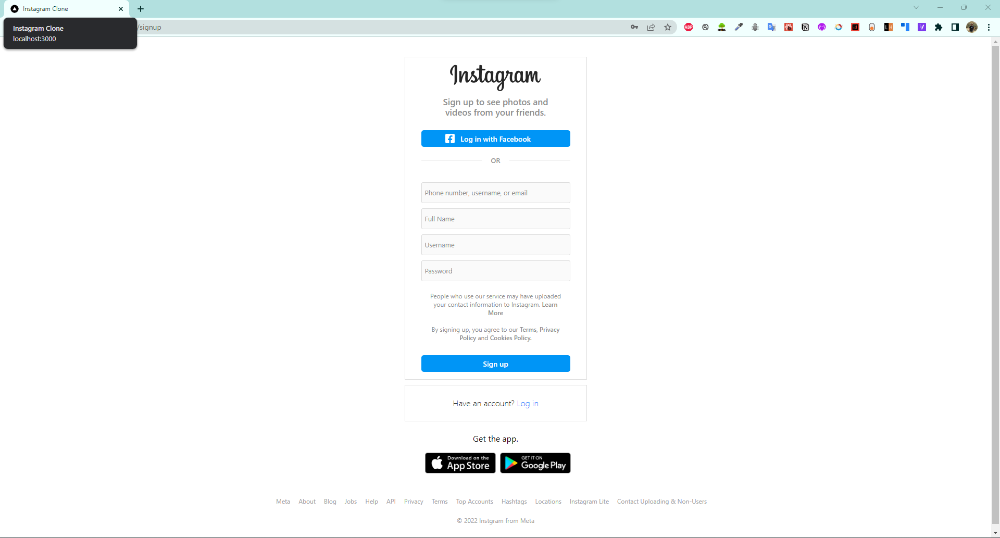
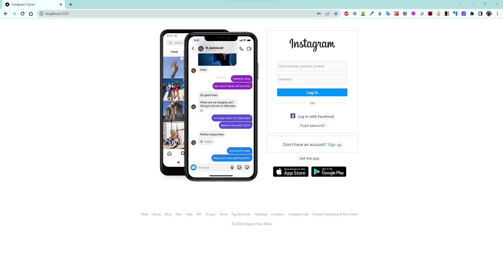
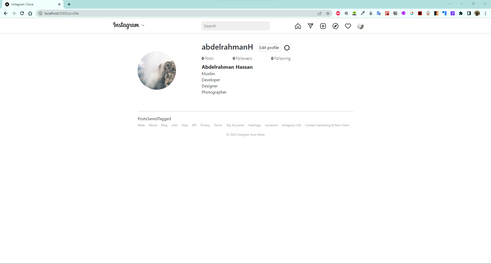

# Instagram-Clone

This is an Instagram-Clone web application built using the MERN Stack - MongoDB, Express, React, and Node.js. It allows users to create an account, share posts with images, like and comment on posts, follow and unfollow other users, and view a feed of posts from the users they follow.

## Technologies Used

* MongoDB: A NoSQL document-based database used to store user data and post information.
* Express: A Node.js web application framework used to build the backend RESTful API.
* React: A JavaScript library used to build the frontend user interface.
* Node.js: A JavaScript runtime used to build the backend server.

## Features

User authentication: Users can create an account, log in, and log out.
Create posts: Users can create a post with an image and a caption.
Like and comment on posts: Users can like and comment on posts created by other users.
Follow and unfollow users: Users can follow and unfollow other users to see their posts in their feed.
Feed: Users can view a feed of posts from the users they follow.

### App is still in processing mode.

### Here are some screenschots of the app.

> Sign Up Page

</img>

> Sign In Page

</img>

> Profile Page

</img>
